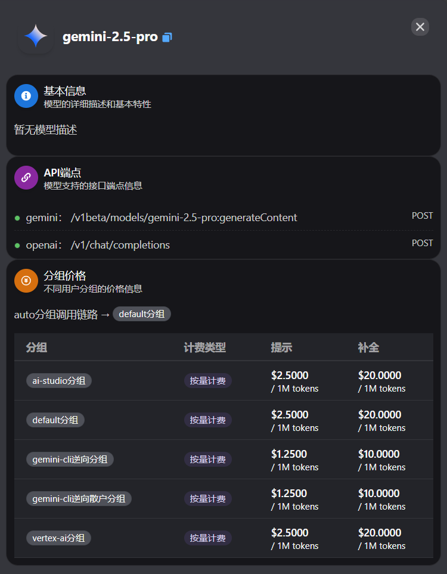

# 高性价比的AI服务 {#sec-ai-service}

## 简介

不言而喻，使用官方的AI服务无疑是体验最好、最稳定的选择，但同时也是最贵的。由于存在大量的没钱又想用AI的用户，市面上出现了不少高性价比的AI服务中转商，他们通过各种薅羊毛、技术手段，提供了比官方更便宜的AI服务。下面我们将介绍一些价格较低且体验不错的AI服务中转商。

## 信息渠道

AI市场的变化非常快，新的中转商和优惠活动层出不穷。为了及时获取最新的信息，建议关注以下几个渠道：

- [Linux.do](https://linux.do/)：这是一个专注于科技和编程的论坛，里面有很多关于AI服务的讨论和推荐，也有很多中转商在那里发布最新的优惠信息。
  - **注册方法**：该论坛的注册比较严格。首先在闲鱼上购买一个“Linux.do邀请码”，价格大概2块钱，然后使用邀请码注册账号。注册时需要50字的“申请自述及加入缘由”，建议写一些和编程、科技相关的内容，并且**一定一定要自己写，不能使用AI生成的内容，否则会被拒绝**。下面是我当时的注册自述范例，供参考：

  > 之前是数据科学背景，比较喜欢折腾，用Python和Rust写过一些小项目，目前对前端比较感兴趣想学一学。希望加入linux.do社区，学一些实战技巧，和佬们交流讨论。

- [中转站竞技场](https://www.aiapipk.com/)：这是一个专门比较各大AI中转商的平台，提供了各个中转商的价格、模型、服务质量等信息，方便用户进行选择。并且这个网站有一个微信群里面有很多中转商在打广告，可以加入。
- **AI模型测评网站**：[LMArena](https://lmarena.ai/)、[LiveBench](https://livebench.ai/)等，从多个维度对各大AI模型进行评测和排名，帮助用户了解不同模型的性能和特点。

## AI中转商的使用方法

大部分AI中转商使用的网站框架都是[New API](https://github.com/QuantumNous/new-api)，因此使用方法大同小异。

### AI中转商使用过程中的常见概念

下图是某中转商的“模型广场”界面中gemini-2.5-pro模型的详情

- **分组**或**渠道**：可以理解为“供货商”。对于同一个模型，中转商可能是从多个不同渠道获得该模型的使用资源，不同渠道的质量、速度、稳定性、价格可能会有所不同。如上图中，gemini-2.5-pro有ai-studio、gemini-cli逆向、gemini-cli逆向散户、vertex-ai等多个分组。这几个里面，vertex-ai是质量最好的。
  - **逆向渠道**：对于一个模型来说，正规的API调用方式是通过官方提供的API接口来调用，并按使用量**付费**。但是大部分AI厂商还会提供网页版的免费对话方式，如[ChatGPT](https://chatgpt.com)、[Gemini](https://gemini.google.com/app)等。也就是说，如果您想通过Cherry Studio来自定义地、高级地使用AI的话，就必须按量付费来使用API；如果您想免费与AI对话的话，就只能使用功能受限的网页版。

  那么，有没有一种方法，可以把网页版的免费AI对话变为API，来在Cherry Studio中使用呢？有的，这就叫做“逆向”。简单来说，您在Cherry Studio中发出一个问题后，AI中转商接收到这个问题，然后它假装是一个普通的人类用户，打开ChatGPT网页版，发出这个问题，获取到答案，再转发给您。

  可以想见，逆向渠道一般比正常的API渠道要便宜很多，但质量和速度也会差一些。有的网站也会把这种渠道叫“2api”，如“Droid2api”，也就是把Droid（一个免费与GPT、Gemini等模型对话的网站）给逆向了。

- **输入/输出**或**提示/补全**：在与AI对话的过程中，输入和输出是分别计费的。一般来说，输入（也就是您发给AI的内容）更便宜，输出（也就是AI发给您的内容）更贵。有的网站会把输入叫做“提示”，输出叫做“补全”。例如上图中，vertex-ai分组的gemini-2.5-pro，输入价格为$2.5/1M tokens，输出价格为$20/1M tokens。Tokens是AI 处理文本的计量单位，一个 token ≈ 4 个英文字符或1～2 个汉字。
- **API端点**：我们在 @sec-get-api 中介绍过，一个模型可以有多种调用方式。在这里，gemini-2.5-pro可以使用gemini方式或openai方式调用，不同调用方式使用的URL不同。

### AI中转商的使用方法

1. 注册账号，登录后前往控制台
2. 充值一点钱，一般充值5-10元就行
3. 在“模型广场”页面，查看您要使用什么模型，以及确定使用什么分组。
4. 在“令牌管理”处新建一个令牌，选择分组。
5. 查看该中转商的API地址（Base URL），一般在首页会有说明。
6. 将API地址与令牌填入Cherry Studio。

## 高性价比的AI模型渠道

### Gemini

- **Google Cloud Free Program（GCP）**：这是Google官方提供的免费套餐，注册后可以获得300美元的GCP使用额度，有效期为90天。通过GCP可以访问Google的所有Gemini模型，非常香。笔者之前薅过这个羊毛，体验非常不错。
  - 优点：官方服务，稳定可靠；免费额度高。
  - 缺点：需要绑定外币信用卡；近期封号严重。
- [AI Wave](https://www.ai-wave.org/)：AI Wave是一个我一直使用的Gemini模型访问的中转商，价格相对较低，且支持按量付费。我目前的主力。
  - 优点：价格较低；支持按量付费。
  - 缺点：在困难时期可能不稳定。
- [Undying API](https://vip.undyingapi.com/console)：Undying API是另一个提供Gemini模型访问的中转商，价格也比较有竞争力。我一般作为备用。
  - 优点：价格较低；支持多种模型。
  - 缺点：不怎么稳定。

### Codex {#sec-codex-service}

- **ChatGPT Team**：这是OpenAI官方提供的团队订阅服务，因为推出了首月体验仅需1美元的优惠活动，所以成了巨大的羊毛。Team和Plus的服务是同等级的，甚至额度更高。
  - 方法：首先要有个ChatGPT账号和上面提到的Linux.do账号。在Linux.do中加入[g-trade](https://linux.do/groups/g-trade)群组，然后网站左侧的侧边栏会出现**“跳蚤市场”**板块。进入跳蚤市场，寻找出售Team订阅的帖子（基本每天都有，价格在6-10元左右；优先选择带“质保”的帖子，这种就是如果不到一个月翻车的话，卖家会退款或上新车）。购买时，您先将您的ChatGPT账号邮箱通过私信发给卖家，卖家会将Team邀请链接发送到您的邮箱，点击链接加入即可。加入后，可将支付宝口令红包发给卖家，即完成交易。每个月到期后可以继续购买新的邀请链接续订。如果一个号的Codex额度不够用，可以多注册几个号，使用[CLIProxyAPI](https://github.com/router-for-me/CLIProxyAPI)做到轮询。
  - 优点：官方服务，稳定可靠；价格极低。
  - 缺点：需要不断购买邀请链接续订；理论上存在封号风险，但一般只封车主，不会封用户。
- 中转商：如[DuckCoding](https://duckcoding.com/)、[Privnode](https://privnode.com/)等，价格略有不同，可查看Linux.do的相关讨论。
  - 优点：按量付费。
  - 缺点：性价比不如Team。

### 学术类AI服务

- [Consensus](https://consensus.app/)：Consensus是一个可以从学术论文中检索内容的AI。同样有教育优惠计划，可以免费获得高级版权限。
- [Google Scholar Lab](https://scholar.google.com/scholar_labs/search?hl=zh-CN&authuser=0)：Google Scholar Lab是Google Scholar推出的学术搜索AI工具，能够帮助用户更高效地查找和整理学术资料。目前可以免费使用。

### 其他 {#sec-other-ai}

- **GitHub Copilot**：GitHub Copilot是微软旗下的AI编程助手，能够帮助用户更高效地编写代码。对于学生和教师，GitHub提供了免费的Copilot使用权限。
  - 方法：前往[GitHub Education](https://github.com/education/students)页面，注册并验证您的学生或教师身份，即可免费获得Copilot的使用权限。注意，认证的时候不能开启VPN。认证时需要使用摄像头拍摄学生证。
  - 优点：学生免费使用；可使用多家AI的模型；与VSCode集成使用体验很好。
  - 缺点：仅限学生和教师使用。
- **Gemini Pro**: 即Gemini的网页高级版。目前有Google官方推出的学生优惠计划，可以免费获得Gemini Pro 12个月的使用权限。可能只能使用某些国家/地区的IP。建议在Linux.do上查看最新的获取方法。
- [DeepWiki](https://deepwiki.com/)：可以索引一个GitHub 仓库的所有代码，您可以直接询问关于这个仓库的所有内容。
