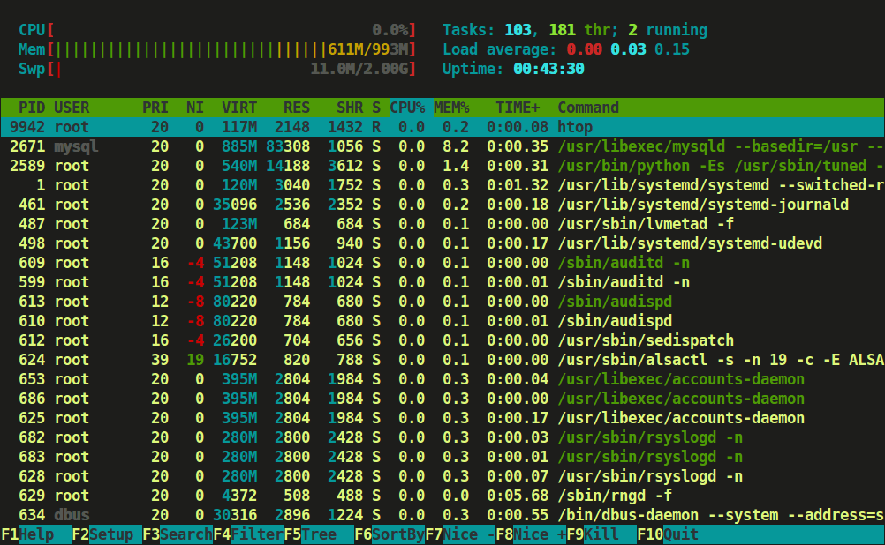

# 系统及终端：Linux {#sec-terminal}

本章我们将讲解生信分析使用的Linux操作系统，终端及Shell的配置和使用方法。

## Linux简介 {#sec-linux-intro}

**Linux**是一种开源的类Unix操作系统，是计算机语言和软件开发的首选操作系统。也是生物信息学分析中最常用的操作系统。如果您在使用服务器进行生信分析的话，服务器一般都是Linux系统。如果您在个人计算机上进行生信分析的话，那么需要分两种情况：如果您原本使用的是MacOS系统，它本身也是基于Unix的系统，和Linux有很多相似之处，所以不用调整；如果您使用的是Windows系统，可以通过安装WSL（Windows Subsystem for Linux）来获得类似Linux的环境，从而更好地进行生物信息学分析。

当然，您可能会问，Windows系统也可以安装R和Python，为什么还要使用Linux系统呢？主要有以下几个原因：

- **编译环境配置困难**：在Windows系统上，安装和配置编译环境（如GCC、Make等）比较复杂，而Linux系统通常预装了这些工具，或者可以通过包管理器轻松安装。
- **命令行工具支持有限**：许多生物信息学工具和脚本都是为Linux系统设计的，在Windows系统上可能无法正常运行或需要额外的配置。
- **Shell难用**：Windows系统的默认命令行界面（CMD和PowerShell）在功能和灵活性方面不如Linux的Shell（如Bash、Zsh等）。

不同于Windows系统通过“点点点”来操作，Linux系统主要是通过命令行来进行操作的。那么，沟通用户和操作系统的桥梁就是**Shell**。Shell是一种命令行解释器，负责接收用户输入的命令，并将其传递给操作系统执行。Shell有很多个版本，Linux中默认的是**Bash**，其他流行的版本还有Zsh、Fish等。我比较推荐**Zsh**，因为它功能强大且易于定制，并且兼容POSIX标准的命令（意思就是大部分Bash的命令都能在Zsh中运行）。见 @sec-zsh 。

## 在 Windows 上安装与使用 WSL {#sec-wsl}

::: {.callout-note}

## 先确认两件事

1. **系统版本**：`wsl --install` 需要 Windows 10 2004+（Build 19041+）或 Windows 11。
2. **管理员权限**：安装时建议用“以管理员身份运行”的 PowerShell/Windows Terminal。
:::

### 安装WSL

打开 PowerShell（管理员），执行：

```powershell
wsl --install
```

这条命令会：

- 启用 WSL 所需的 Windows 功能
- 默认安装一个 Linux 发行版（通常是 Ubuntu）

按提示重启电脑。重启后，第一次打开 Ubuntu 会让您设置：

- Linux 用户名
- Linux 密码（输入时不会显示字符，这是正常的）

如果您想指定发行版（例如 Ubuntu），可以用：

```powershell
wsl --list --online
wsl --install -d Ubuntu
```

如果 `wsl --install` 只输出帮助信息，通常表示 WSL 已经装过了；这时也可以直接用上面的 `--list --online` 与 `--install -d ...` 来安装/补装发行版。

### 进入 WSL 后做的第一件事

进入 WSL（打开“Ubuntu”或在 PowerShell 里输入 `wsl`）后，先更新系统：

```bash
sudo apt update
sudo apt upgrade -y
```

如果您在国内网络环境，`apt update`/安装软件很慢，可以把 Ubuntu 的软件源切到清华 TUNA 镜像。

```bash
# 备份 sources.list
sudo cp /etc/apt/sources.list /etc/apt/sources.list.bak.$(date +%F)

# 替换镜像（常见两处：archive + security）
sudo sed -i 's@http://archive.ubuntu.com/ubuntu/@https://mirrors.tuna.tsinghua.edu.cn/ubuntu/@g' /etc/apt/sources.list
sudo sed -i 's@http://security.ubuntu.com/ubuntu/@https://mirrors.tuna.tsinghua.edu.cn/ubuntu/@g' /etc/apt/sources.list

# 重新刷新索引
sudo apt update
```

不同 Ubuntu 版本、以及是否启用 `deb-src`/第三方源，可能会略有差异；以清华 TUNA 的说明为准：  
[TUNA mirrors](https://mirrors.tuna.tsinghua.edu.cn/help/ubuntu/)（进入后搜索 Ubuntu）。

然后装一些“几乎总会用到”的基础工具：

```bash
sudo apt install -y build-essential git curl wget
```

### Windows与WSL的文件系统

在WSL中，您会同时看到两套文件系统：

- **Linux 文件系统**：您的家目录是 `~`（例如 `/home/<用户名>`）。
- **Windows 硬盘挂载**：一般在 `/mnt/c`、`/mnt/d` 这类路径下。

这两套文件系统是可以互通的，打开 Windows 文件资源管理器，在左侧的侧边栏可以看到“Linux”的文件系统入口。

### 在 VS Code 里打开 WSL 项目

您有两种最常见的方式：

1. **从 WSL 里进 VS Code**：在 WSL 终端进入项目目录后执行：

```bash
cd ~/projects/myproj
code .
```

2. **从 VS Code 里连 WSL**：安装 VS Code 的 “Remote - WSL” 相关扩展后，在左侧“远程资源管理器（Remote Explorer）”选择 WSL 目标打开目录。

用 VS Code 连上 WSL 后，您看到的是 Linux 环境：终端、路径、`apt`、`bash` 都是 WSL 里的，不是 Windows 的。

## Linux基础 {#sec-linux-basics}

这一节覆盖终端里最常见的“基础但高频”的能力：会看路径、会读文件、会装软件、会排查资源、会传输数据。

### 文件与路径基础

**常见目录：**

- `/`：根目录
- `/home`：用户家目录的上一级目录；您的家目录通常是 `/home/<用户名>`，也写作 `~`
- `./`：当前所在的目录
- `../`：当前所在目录的上一级目录

绝对路径与相对路径：

- 绝对路径以 `/` 开头，例如 `/home/alice/projects`
- 相对路径相对**当前所在的目录**，例如，如果您当前在`/home/alice`，则`/home/alice/projects`的相对路径是`./projects`或`projects`。如果您当前在`/home/alice/projects`，则`/home/alice`的相对路径是`../`。

显而易见，一个文件/目录的绝对路径是唯一的，在任何位置都能访问到；而相对路径则依赖于您当前所在的位置。

在生信分析中，我们更推荐使用**相对路径**，这可以保证您的代码迁移到其他机器或目录时，路径依然有效。

隐藏文件以 `.` 开头，例如 `~/.bashrc`。用 `ls -a` 才能看到。

读文件与浏览目录的最小命令集：

```bash
pwd
ls -alh
cd /path/to/dir
cat small.txt
less big.txt         # q 退出，/ 搜索
```

在Linux中，查找文件常用 `find` 和 `fd`（需要先安装）。`fd` 是 `find` 的现代替代品，更快更易用。

常用示例：

```bash
fd fastq .                 # 在当前目录递归找名字含 fastq 的文件
fd -e gz .                 # 按扩展名过滤
fd -t d results .          # 只找目录（type=directory）
fd -H -E .git config .     # 包含隐藏文件(-H)，排除某目录(-E)
```

**通配符：**

通配符是在文件名或路径中使用的特殊字符，用于匹配多个文件或目录。最常用的通配符是`*`，表示匹配任意数量的字符（包括零个字符）。例如：

- `*.fastq.gz`：匹配所有以 `.fastq.gz` 结尾的文件

其余还有：

- `sample?.fq.gz`：`?` 匹配 1 个字符，如 `sample1.fq.gz`、`sampleA.fq.gz`
- `data/{A,B}.txt`：大括号展开，匹配 `data/A.txt` 和 `data/B.txt`

### 权限与所有权

Linux 是多用户系统，每个文件/目录都有**所有者**和**权限**。权限分为三类用户：**所有者（user）**、**所属组（group）**、**其他人（others）**，每类用户有三种权限：**读（read）**、**写（write）**、**执行（execute）**。我们可以用 `ls -l` 看权限与所有者，它会按照上述的顺序显示三类用户的权限，每个权限用一个字符表示，`r/w/x` 分别表示读/写/执行。目录的 `x` 表示“可进入/可遍历”。

例如：

```bash
-rwxr-xr-- 1 alice bioinfo 2048 Jun  1 12:00 script.sh
```

表示 `script.sh` 文件：

- 所有者是 `alice`，所属组是 `bioinfo`
- 所有者有读/写/执行权限（`rwx`）
- 所属组有读/执行权限（`r-x`）
- 其他人只有读权限（`r--`）

我们可以用 `chmod` 改权限、`chown` 改所有者：

```bash
chmod u+x script.sh
chmod 755 script.sh
chown user:group file.txt
umask
```

### 软件管理

在 Linux 系统中，系统级别的软件通常通过包管理器安装和管理。常见的包管理器有：

- Debian/Ubuntu：`apt`
- RHEL/CentOS：`dnf`（旧系统可能是 `yum`）

`apt` 常用操作：

```bash
apt search samtools
sudo apt install -y samtools
sudo apt upgrade -y
sudo apt remove -y samtools
sudo apt autoremove -y
sudo apt clean
```

但是，使用包管理器需要管理员权限（`sudo`）。在大多数情况下，作为普通用户，我们大多数情况下会使用**用户级别的软件安装**，例如`pixi`、`conda/mamba`等（查看 @sec-env-mgmt ）。

### Shell 与配置

常见 Shell：Bash（默认普遍）、Zsh（交互体验更好，后面会配置 @sec-zsh ）。

Shell的常见配置文件：

- `~/.bashrc` / `~/.zshrc`：主要配置文件（别名、提示符、补全）
- `~/.profile`：登录环境变量初始化（更适合放 `PATH` 等环境变量）

放在这些文件里的配置会在每次打开新终端时自动加载。

**alias** 和 **PATH** 是两个非常重要的配置项。alias是命令的别名，可以让您用更短的命令来执行常用的操作；PATH是一个环境变量，告诉Shell在哪些目录下、以什么顺序查找软件。
把高频命令缩写成别名、把常用软件目录加入PATH，可以显著提高效率。例如：

- **添加别名**：假设您经常用 `ls -alh` 来查看目录内容，可以给它设置一个别名 `ll`

```bash
echo "alias ll='ls -alh'" >> ~/.zshrc
echo "alias gs='git status'" >> ~/.zshrc
source ~/.zshrc   # 让当前终端立即生效
```

这样您以后只需输入 `ll` 就能执行 `ls -alh`。

- **设置PATH**：假设您安装了一个叫 `mytool` 的软件，并把它放在 `~/.local/bin` 目录下，您可以把这个目录加入PATH

```bash
echo 'export PATH="$HOME/.local/bin:$PATH"' >> ~/.zshrc
source ~/.zshrc
which mytool   # 验证命令可被找到
```

- **按需分层**：
  - 单次会话：在命令行直接 `export PATH=...` 或 `alias ...`，关闭终端即失效。
  - 当前用户长期生效：写入 `~/.zshrc`（Zsh）或 `~/.bashrc`（Bash）。
  - 系统所有用户：需写入 `/etc/profile` 等，全局修改前请确认权限与影响。

- **排错小贴士**：`echo $PATH` 看顺序，`hash -r` 刷新命令缓存，避免在PATH末尾留下多余的`:`。

### 进程与资源

有时当您运行很多生信分析任务时，可能会遇到系统资源不足的问题，例如CPU占用过高、内存不足等。此时，您可以使用一些命令来查看和管理系统资源。

`htop` 是一个交互式的进程查看器，可以实时显示系统资源使用情况和进程信息。安装后，直接运行 `htop` 即可。



- **顶部条形图**：CPU（多核会分条/分色）、Mem（内存）、Swap（交换分区）。用来快速判断“是不是 CPU 打满/内存爆了”。
- **中间进程列表**：每一行是一个进程/线程；常见列包括 `PID`（进程号）、`USER`（谁启动的）、`%CPU`、`%MEM`、`TIME+`（累计CPU时间）、`COMMAND`（命令）。
- **底部快捷键**（通常是 F 键）：最常用的是
  - `F6`：选择排序列（常用按 `%CPU` / `%MEM` 排）
  - `F9`：结束进程（发送信号；一般先选 `TERM`，实在不行再 `KILL`）
  - `F5`：树状视图（看父子进程关系，定位谁“带起来”的）
  - `F3` 搜索 / `F4` 过滤 / `F10` 退出

### 磁盘与存储

您可以使用`df`来查看磁盘空间使用情况，`du`来查看某个目录或文件的大小。例如：

```bash
df -h
du -sh *
```

类似于 Windows 里的“快捷方式”，Linux 里有**符号链接（symlink）**，可以让您用一个路径指向另一个路径。创建符号链接用 `ln -s`：

```bash
ln -s /data/big/project_data ~/projects/project_data
```

这样，您就可以通过 `~/projects/project_data` 来访问 `/data/big/project_data` 了。

### 网络与传输

远程登录通常用 SSH（细节见 @sec-ssh-basics 与 @sec-vscode-remote-ssh）：

```bash
ssh user@server -p 22
```

当您需要在本地和远程服务器之间传输文件时，可以使用 `scp` 或 `rsync`。`scp` 是最基本的文件传输命令，而 `rsync` 则更适合大文件或大量文件的传输，因为它支持增量同步和断点续传。

```bash
rsync -avh --progress local_dir/ user@server:/path/to/dir/
rsync -avh --progress user@server:/path/to/dir/ local_dir/
```

端口转发可以让您通过 SSH 隧道访问远程服务器上的服务，例如 Jupyter Notebook、RStudio Server 等。例如，您在远程服务器上运行了一个 Jupyter Notebook 服务，监听在 8888 端口上，您可以通过以下命令将远程的 8888 端口映射到本地的 8888 端口：

```bash
ssh -L 8888:localhost:8888 user@server
```

这样，您就可以在本地浏览器中访问 `http://localhost:8888` 来使用远程的 Jupyter Notebook 了。在VS Code中端口转发十分方便，可以直接在底部面板的“端口”标签页里添加和管理端口转发。

### 压缩与归档

在Linux系统中，常用的压缩和归档工具有`tar`、`zip`和`pigz`。它们可以帮助您节省存储空间和传输时间。

```bash
tar -czvf results.tar.gz results/
tar -xzvf results.tar.gz
zip -r results.zip results/
unzip results.zip
pigz -p 8 big.fastq
```

## 常用Linux命令 {#sec-linux-commands}

以下是一些最常用的Linux命令，建议您熟练掌握它们：

- `ls`：列出当前目录下的文件和文件夹。
- `cd`：切换当前工作目录。
- `pwd`：显示当前工作目录的完整路径。
- `mkdir`：创建一个新的目录。
- `rm`：删除文件或目录（使用`-r`选项可以递归删除目录）。
- `cp`：复制文件或目录。
- `mv`：移动或重命名文件或目录。
- `cat`：显示文件内容。
- `find`：在目录中查找文件或目录。
- `htop`：实时显示系统资源使用情况和进程信息。
- `kill`：终止指定的进程。
- `wget`：从网络上下载文件。

如果学有余力，我非常建议您看看这个[Bash 脚本教程](https://wangdoc.com/bash/)。

## Zsh配置 {#sec-zsh}

原版的Zsh可能比较简陋，我们可以通过安装一些插件和主题来增强其功能和美观性。我们首先需要一个插件管理器来方便地安装和管理插件。最流行的插件管理器是Oh My Zsh!，但我推荐使用[GitHub - sorin-ionescu/prezto: The configuration framework for Zsh](https://github.com/sorin-ionescu/prezto)，因为它速度要快很多。

安装完Prezto后，我们可以安装一些常用的插件：

- environment
- terminal
- editor
- history
- directory
- spectrum
- utility
- completion
- git
- syntax-highlighting
- history-substring-search
- autosuggestions：可以在输入命令时提供自动补全建议，按`→`键接受建议。
- contrib-prompt
- prompt
- zsh-z：可以通过`z <关键词>`快速跳转到之前访问过的目录。

我们还可以安装一些主题来美化Zsh的外观。我使用的是[Powerlevel10k](https://github.com/romkatv/powerlevel10k)，按照其官方文档进行安装和配置即可。

### fzf：模糊搜索（文件/历史/目录）

`fzf` 可以把“找文件 / 找命令历史 / 找目录”变成一个交互式的模糊搜索框，效率非常高。您可以先使用`pixi global install fzf`安装它，或者用包管理器安装（Ubuntu 下是 `sudo apt install fzf`）。

**启用快捷键与补全（Zsh）**：Ubuntu 的 `fzf` 包自带示例脚本，把下面两行加到 `~/.zshrc`：

```bash
source <(fzf --zsh)
```

重新加载配置：

```bash
source ~/.zshrc
```

**最常用的三个快捷键**：

- `Ctrl+T`：在当前目录递归选文件/目录，把路径插入命令行
- `Ctrl+R`：模糊搜索历史命令
- `Alt+C`：模糊搜索目录并 `cd` 过去

## 终端复用器：Zellij {#sec-zellij}

您可能已经发现，当您在一个终端中运行一个任务时，不能关闭这个终端，否则任务就会被中断。并且，每次打开一个新的终端时，都不能看到之前的任务状态。这时候，终端复用器就派上用场了。

**Zellij**是一个现代化的终端复用器。所谓终端复用器，就是把终端托管在一个后台服务中，然后通过客户端连接到这个服务，从而实现多个终端窗口的管理和任务的持续运行。这样，每次打开终端时，都可以无缝连接到之前的会话，继续查看和管理之前的任务。并且，任务可以在后台运行，不会因为关闭终端而中断。

::: {.callout-note}

## Note

虽然我们不用担心终端关闭会中断任务，但是终端复用器的服务需要持续在后台运行。因此，如果您关闭了计算机或WSL，之前的会话就会丢失，任务也会被中断。终端复用器最好的使用场景是在服务器上，或者如果您能保证本地计算机或WSL持续运行。
:::

安装完Zellij后，您可以安装[zjstatus](https://github.com/dj95/zjstatus)来美化Zellij的状态栏。

Zellij的学习曲线可能比较陡峭，您可以多多使用AI并参考官方文档来学习它的使用方法。以下是一些您可以进行的操作：

- 将反引号（`）设置为Leader键
- 将`alias za='zellij attach --create main'`添加到`.zshrc`文件中，以便快速连接到同一个Zellij会话
- 学习Pane和Session的概念，以及如何创建、切换、关闭它们

## 高性能计算集群（HPC）的使用 {#sec-hpc-slurm}

课题组的服务器通常是**HPC（High Performance Computing）集群**，拥有一个登录节点和多个计算节点。集群通常用**作业调度系统**（最常见之一就是SLURM）来“排队+分配资源”，避免大家互相抢机器。

**登录节点 vs 计算节点**

- **登录节点（login node）**：用来登录、编辑代码、管理文件、提交作业。通常**不允许**长时间/高负载计算。
- **计算节点（compute node）**：真正跑计算的地方。您必须通过SLURM申请资源后，才能在计算节点上运行耗时任务。

::: {.callout-caution}

## Caution

不要在登录节点上直接跑STAR/bwa/gatk/cellranger之类的重任务；即使能跑，也可能被管理员直接kill，或影响他人使用。
:::

### 常用的SLURM命令

```bash
# 查看集群分区/节点情况（哪些分区可用、是否空闲等）
sinfo

# 查看自己的排队/运行作业
squeue -u $USER

# 取消作业
scancel <job_id>

# 查看作业更详细的信息（为什么Pending、分配了哪些资源）
scontrol show job <job_id>

# 查看历史资源使用（是否超内存、跑了多久；不同集群可能需要额外权限/配置）
sacct -j <job_id> --format=JobID,JobName%20,State,Elapsed,ReqMem,MaxRSS,AllocCPUS

# 申请一个交互式资源（参数随集群而异：partition/account/qos等）
salloc -p <partition> -c 4 --mem 16G -t 01:00:00

# 拿到资源后，在计算节点上开一个交互式bash
srun --pty bash
```

::: {.callout-note}

## Note

交互式作业适合“短、轻、调试”。真正的批量分析（跑几小时/几天）建议用`sbatch`提交批处理脚本。
:::

### 写一个最小可运行的 `sbatch` 脚本

新建 `run_demo.sbatch`：

```bash
#!/usr/bin/env bash
#SBATCH --job-name=demo
#SBATCH --partition=<partition>
#SBATCH --cpus-per-task=4
#SBATCH --mem=16G
#SBATCH --time=02:00:00
#SBATCH --output=logs/%x_%j.out
#SBATCH --error=logs/%x_%j.err

set -euo pipefail

echo "JobID: $SLURM_JOB_ID"
echo "Node:  $(hostname)"
echo "CWD:   $(pwd)"

# 建议：显式控制线程数，避免“申请4核但程序开了32线程”
export OMP_NUM_THREADS="$SLURM_CPUS_PER_TASK"

# 您的真实命令示例（把参数写全，不要依赖交互式环境）
# bwa mem -t "$SLURM_CPUS_PER_TASK" ref.fa sample.fq.gz | samtools sort -@ "$SLURM_CPUS_PER_TASK" -o sample.sorted.bam
sleep 5
```

提交与查看：

```bash
mkdir -p logs
sbatch run_demo.sbatch
squeue -u $USER
```

### 常见注意事项

- **资源申请要和程序线程数一致**：常见错误是“申请4核，但程序默认开满节点所有核”。请在命令里显式指定线程（如 `-t/-@/--threads`），并配合 `OMP_NUM_THREADS`。
- **内存单位与含义**：`--mem=16G` 通常是“整个任务总内存”，`--mem-per-cpu` 则是“每CPU内存”。不同集群对单位（G/GiB）与默认值略有差别，提交前看集群文档/`man sbatch`。
- **Pending 不等于坏了**：很多作业只是“排队”。用 `scontrol show job <job_id>` 看原因（资源不足、优先级、配额、分区限制等）。
- **Walltime 到点会被杀**：`--time` 不够就会强制结束；建议先小数据估时间，再放大。
- **I/O 是隐形瓶颈**：大量小文件、频繁读写网络家目录会极慢。能用集群的`$SCRATCH`/`$TMPDIR`就用，结束后把关键结果拷回`$HOME`或项目目录。
- **环境可复现**：不要依赖您“登录后手动source过”的状态。把`module load ...`或环境激活命令写进脚本（也可以在脚本里打印`which python`、`python -V`自检）。
