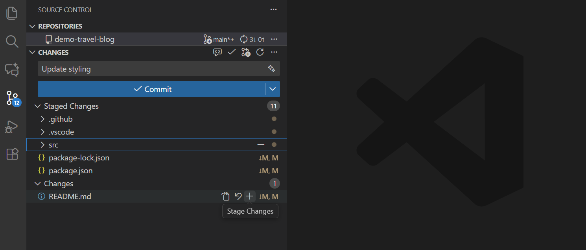
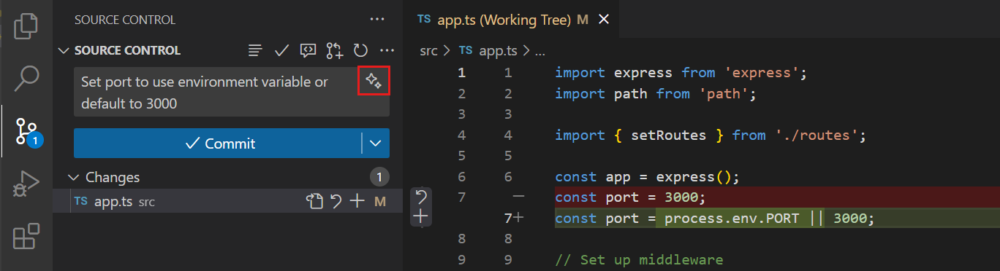

# 版本控制：Git {#sec-version-ctrl}

## 背景
有一次，大毛让AI帮自己“顺手优化一下脚本”，结果AI非常勤快，不仅改了目标函数，还把原本能跑通的几段代码一起重写了。等大毛发现结果不对时，文件早已被覆盖，连自己之前改过哪些地方都想不起来。他只记得昨天还能出图，今天却怎么都回不去了。

那一刻，大毛终于理解了一个残酷现实：在AI时代，代码写得快不算本事，改坏之后还能退回去，才是真本事。于是他开始寻找一种“后悔药”——每改一步都能留下痕迹，出问题时还能一键回到过去。

## 简介

在生物信息学分析中，代码和数据的版本控制是确保分析可复现性和协作开发的重要手段。版本控制系统（Version Control System, VCS）可以帮助我们跟踪代码的变化，记录每次修改的内容和原因，并且能够轻松地回滚到之前的版本。

打个比喻的话，版本控制就像游戏中的存档系统。每当您完成一个重要任务或达到一个里程碑时，您就可以创建一个**“存档点”**（commit）。如果之后的操作出现了问题，您可以随时回到之前的存档点，避免损失进度。尤其对于我们这种以AI写代码为主的工作流程来说更为重要，因为AI不仅可能会生成错误的代码，还可能会覆盖掉之前正确的代码。这时，版本控制就能帮助我们一键回到之前的正确版本，极大地提升了工作效率和代码质量。

**Git**是目前全世界最流行的版本控制系统。在本节中，我们将介绍Git、GitHub、DVC等工具的基本概念和使用方法，帮助大家高效地进行代码管理和协作开发。

## Git的使用逻辑 {#sec-git-basics}

Git的逻辑对于初学者来说可能有些复杂，一个代码文件在Git中会有好几个阶段。我们通过下面这个（我自创的）比喻来理解Git的工作流程。

想象一下您是一个餐厅的服务员，负责把后厨做好的菜端到顾客的桌上。您有一个大托盘，每次可以带很多道菜。我们假设一道菜就是一个代码文件。一个代码文件会经历以下几个阶段：

1. **未跟踪（Untracked）**：这就像是后厨刚做好的菜，还没有放到托盘上。Git还没有开始跟踪记录这个文件。
2. **暂存（Staged）**：这就像是您把菜放到了托盘上，准备端给顾客。也就是说，您告诉Git您准备好要提交这个文件了。您的大托盘上可以放很多道菜，这些菜都是给一桌顾客准备的。也就是，我们可以一次性暂存多个文件，这些文件都属于一个目的或任务。如果此时您发现有道菜放错了，或者需要改动，您可以把它从托盘上拿下来重新处理，这就相当于您可以取消暂存（unstage）某个文件，进行修改后再重新暂存。
3. **提交（Committed）**：当您把这桌顾客的所有菜都摆到托盘上后，您就可以把托盘端到顾客的桌上了。这就相当于您把这些文件正式提交到了Git的版本库中，形成了一个新的版本。提交了的文件一般不会再轻易撤回修改，就像菜端到顾客桌上后，您不会再轻易把菜拿回去改动一样。但是，如果顾客对菜不满意，您可以重新做一道菜，然后再端上去，这就相当于您可以创建一个新的提交，来修改之前的版本。

对于一个单人工作的项目来说，90%的Git操作只需要用到这三个阶段就够了。

如果您还想将您的代码备份到远程（比如GitHub上），您还需要了解三个额外的操作：

4. **推送（Push）**：把本地的所有代码和历史记录推送到远程仓库，这样您的代码就有了一个备份，并且您可以在任何地方访问、修改它。
5. **拉取（Pull）**：从远程仓库拉取最新的代码和历史记录到本地，这样您就可以获得最新的代码版本。
6. **克隆（Clone）**：当您在一台新电脑上想要开始工作时，您可以从远程仓库克隆一份代码到本地，这样您就有了完整的代码和历史记录。

## Git的常用命令 {#sec-git-commands}

初始设置（执行一次即可）：

```bash
git config --global user.name "Your Name"
git config --global user.email "you@example.com"
git config --global init.defaultBranch main
# 可选：保存凭证（按需选择一种）
# git config --global credential.helper cache   # 暂存到内存
# git config --global credential.helper store   # 明文保存，谨慎
# git config --global credential.helper manager # Windows/Mac 常用
```

### 本地仓库操作

- `git init`：在当前目录下初始化一个新的Git仓库。
- `git status`：查看当前Git仓库的状态，显示哪些文件是未跟踪的、已修改的或已暂存的。
- `git add <file>`：将指定的文件添加到暂存区，准备提交。如果要添加所有修改的文件，可以使用`git add .`。
- `git commit -m "commit message"`：将暂存区的文件提交到版本库，并添加提交信息。

### 远程仓库操作

- `git clone <repository-url>`：从远程仓库（如GitHub）克隆一个完整的项目到本地，包含所有代码和历史记录。
- `git remote add origin <repository-url>`：为本地仓库添加远程仓库地址。通常在`git init`创建本地仓库后使用。
- `git push`：将本地提交推送到远程仓库。第一次推送时需要指定分支。
- `git pull`：从远程仓库拉取最新的更改并合并到当前分支。相当于`git fetch`（获取更新）加上`git merge`（合并更新）。
- `git remote -v`：查看当前配置的远程仓库地址。

## 在VSCode中使用Git {#sec-vscode-git}

虽然我们可以在终端中使用Git命令，但VSCode提供了强大的图形界面，让Git操作变得更加直观和便捷。对于初学者来说，使用VSCode的Git功能可以大大降低学习曲线。

### 打开源代码管理面板

在VSCode左侧活动栏中，点击"源代码管理"图标（或使用快捷键 `Ctrl+Shift+G`），就可以打开Git面板。这个面板会显示：

- 当前分支名称
- 所有有变化的文件列表
- 暂存区的文件
- 提交历史（需要安装Git Graph等扩展）

### 暂存文件（Stage）

当您修改了文件后，这些文件会出现在"更改"（Changes）列表中。要暂存文件：

1. 将鼠标悬停在文件名上，会出现一个"+"按钮
2. 点击"+"按钮，文件会移动到"暂存的更改"（Staged Changes）区域
3. 或者点击"更改"标题旁的"+"按钮，可以一次性暂存所有文件

{#fig-vscode-git-stage}

如图 @fig-vscode-git-stage 所示，您可以方便地选择要暂存的文件。

::: {.callout-tip}

## 查看文件差异

点击文件名可以查看文件的具体修改内容（diff），红色表示删除的内容，绿色表示新增的内容。这对于确认修改内容非常有帮助。

:::

### 提交更改（Commit）

暂存文件后，就可以提交更改了：

1. 在源代码管理面板顶部的文本框中输入提交信息
2. 点击"✓"（提交）按钮或按 `Ctrl+Enter`
3. 提交成功后，暂存区会被清空

{#fig-vscode-git-commit}

如图 @fig-vscode-git-commit 所示，提交信息应该简洁明了地描述本次更改的内容。

::: {.callout-note}

## 提交信息规范

好的提交信息应该：

- 简洁明了，一句话说清楚做了什么
- 使用动词开头，如"添加"、"修复"、"更新"
- 示例：`添加RNA-seq分析脚本`、`修复基因注释错误`

:::

### 同步到远程仓库（Push/Pull）

如果您的项目连接了GitHub等远程仓库，可以使用同步功能：

1. 提交更改后，点击左下角的同步按钮（圆形箭头图标）
2. 或者点击"..."菜单，选择"推送"（Push）或"拉取"（Pull）
3. VSCode会自动将本地更改推送到远程仓库，或从远程仓库拉取最新更改

{#fig-vscode-git-sync-remote}

如图 @fig-vscode-git-sync-remote 所示，同步按钮会显示待推送和待拉取的提交数量。

### 其他常用操作

**撤销更改**：

- 在未暂存的文件上点击"↶"按钮，可以撤销该文件的所有修改
- 在已暂存的文件上点击"-"按钮，可以取消暂存

**查看历史**：

- 安装"Git History"或"Git Graph"扩展可以可视化查看提交历史
- 点击左下角的分支名称可以切换分支

**解决冲突**：

- 当出现合并冲突时，VSCode会高亮显示冲突区域
- 点击"接受当前更改"或"接受传入更改"来解决冲突

::: {.callout-tip}

## 推荐的VSCode Git扩展

- **Git Graph**：可视化查看分支和提交历史
- **GitLens**：增强的Git功能，显示代码的作者和修改历史
- **Git History**：查看文件和行的修改历史

这些扩展可以在VSCode的扩展市场中搜索安装。
:::

## .gitignore文件 {#sec-gitignore}

在使用Git管理项目时，有些文件我们不希望Git跟踪，比如：

- **大型数据文件**：测序数据（.fastq.gz）、比对文件（.bam、.sam）等
- **临时文件**：运行过程中产生的缓存、日志文件
- **敏感信息**：配置文件中的密码、API密钥等
- **系统文件**：操作系统自动生成的文件（如macOS的.DS_Store）
- **依赖包**：Python的虚拟环境、R的包库等

`.gitignore`文件就是用来告诉Git哪些文件或目录不需要跟踪的。

在项目根目录下创建一个名为`.gitignore`的文件（注意文件名以点开头），然后在其中列出不需要跟踪的文件模式。

以下是一个适合生物信息学项目的`.gitignore`示例：

```bash
# 测序数据文件（原始数据和中间结果）
*.fastq
*.fastq.gz
*.fq
*.fq.gz
*.bam
*.sam
*.vcf
*.vcf.gz
*.bed
*.wig
*.bigWig

# 大型数据目录
data/raw/
data/processed/
results/temp/

# R相关
.Rproj.user/
.Rhistory
.RData
.Ruserdata
*.Rproj

# Python相关
__pycache__/
*.py[cod]
*$py.class
.ipynb_checkpoints/
*.egg-info/
venv/
env/
.env

# 日志和临时文件
*.log
*.tmp
*.temp
~$*

# 系统文件
.DS_Store
Thumbs.db
*.swp
*.swo

# 编辑器配置（可选，团队协作时可能需要保留）
.vscode/
.idea/
```

::: {.callout-tip}

## 使用模板快速创建

GitHub提供了各种语言和项目类型的`.gitignore`模板：

- 访问 [github.com/github/gitignore](https://github.com/github/gitignore)
- 或在创建GitHub仓库时，选择对应的`.gitignore`模板（如Python、R等）

:::

## Git分支 {#sec-git-branches}

分支（branch）是Git中一个非常重要的概念。简单来说，分支就像是平行世界——您可以在一个分支上进行实验性的修改，而不影响主分支上的稳定代码。

### 为什么需要分支？

想象一下这样的场景：您正在分析一个项目，突然想尝试一个新的分析方法，但不确定这个方法是否可行。如果直接在原有代码上修改，可能会把原本正常运行的代码弄乱。这时候，分支就派上用场了：

1. **安全实验**：在新分支上尝试新想法，失败了可以直接删除分支，不影响主分支
2. **并行开发**：可以同时维护多个功能或版本（例如一个稳定版本分支和一个开发分支）
3. **协作开发**：多人合作时，每个人在自己的分支上工作，完成后再合并到主分支

### 基本分支操作

```bash
# 查看所有分支（当前分支前有*标记）
git branch

# 创建新分支
git branch new-analysis

# 切换到某个分支
git checkout new-analysis
# 或使用更新的命令（推荐）
git switch new-analysis

# 创建并切换到新分支（一步到位）
git checkout -b new-analysis
# 或
git switch -c new-analysis

# 合并分支（先切换到要接收更改的分支，通常是main）
git switch main
git merge new-analysis

# 删除已合并的分支
git branch -d new-analysis

# 强制删除分支（即使未合并）
git branch -D new-analysis
```

### 实际使用示例

假设您正在做一个RNA-seq分析项目，想尝试两种不同的差异表达分析方法：

```bash
# 1. 在main分支上已经有基本的数据预处理代码

# 2. 创建一个新分支尝试DESeq2方法
git switch -c deseq2-analysis
# 在这个分支上编写和测试DESeq2的代码
git add analysis_deseq2.R
git commit -m "Add DESeq2 analysis"

# 3. 切回main分支，创建另一个分支尝试edgeR方法
git switch main
git switch -c edger-analysis
# 编写和测试edgeR的代码
git add analysis_edger.R
git commit -m "Add edgeR analysis"

# 4. 比较两种方法后，决定使用DESeq2，合并到main分支
git switch main
git merge deseq2-analysis

# 5. 删除不需要的edgeR分支
git branch -d edger-analysis
```

## GitHub介绍 {#sec-github-basics}

**GitHub**是全球最大的代码托管平台，基于Git版本控制系统。它不仅提供了一个在线的Git仓库，还提供了丰富的协作功能，如问题跟踪（Issues）、拉取请求（Pull Requests）、项目管理等。

初学者看到GitHub可能会觉得手足无措，我们下面通过几个常用的场景来介绍GitHub的基本使用方法。

1. **我想查找别人的一个项目，应该怎么做？**

   您可以直接在GitHub的搜索栏中输入关键词，找到相关的仓库（repository）。也可以通过Google搜索，例如输入“project name GitHub”来查找。

2. **我进入到一个仓库页面了，页面上的这些东西都是什么意思？**
   - **Code**：这是仓库的代码页面，您可以浏览和下载代码。在下方会自动展示仓库的README.md文件，里面通常包含了项目的介绍和使用说明。
   - **Issues**：这是问题跟踪页面，用户可以在这里报告bug或提出功能请求。
   - **Releases**：这是发布页面，项目维护者会在这里发布软件的正式版本。
   - **Wiki**：这是项目的维基页面，通常包含了更详细的文档和教程。

3. **我想搜索一下我遇到的error，应该怎么做？**

   在该仓库的右上角有一个搜索框，您可以在这里输入关键词来搜索整个仓库的代码和文档。查看一下issues，很可能别人也遇到过类似的问题。

4. **我啥都懒得看，就想问我遇到的问题，怎么办？**

   将网址中的`github.com`替换为`deepwiki.com`，进入DeepWiki页面，在这里您可以直接对整个仓库的内容进行提问。

## DVC（数据版本控制）基础 {#sec-dvc-basics}

Git只适合管理小文件和代码，对于大文件（如几十GB的测序数据）则不太适用。因为Git会将每个版本的文件都存储下来，导致仓库体积迅速膨胀，难以管理和传输。

**DVC（Data Version Control）** 是一个专门为数据科学和机器学习设计的数据版本控制工具。它的工作原理是：Git只跟踪"大文件的元数据"（一个小的 .dvc 文件），真正的数据存放在远程存储（如云存储、NAS等）；这样既能版本控制数据，又不会把几十GB的数据文件推到GitHub。

### 最小可用流程

```bash
# 1) 安装DVC（使用conda或pip）
pixi global install dvc

# 2) 在已有Git仓库中初始化DVC
dvc init
git add .dvc .dvcignore
git commit -m "Initialize DVC"

# 3) 配置远程存储（以本地目录为例，实际可用S3等）
dvc remote add -d storage /path/to/dvc-storage
# 或使用SSH远程服务器
# dvc remote add -d storage ssh://user@server:/path/to/storage
git add .dvc/config
git commit -m "Configure DVC remote storage"

# 4) 添加大文件到DVC跟踪
dvc add data/raw/sample.fastq.gz
# 这会生成 data/raw/sample.fastq.gz.dvc 文件
git add data/raw/sample.fastq.gz.dvc data/raw/.gitignore
git commit -m "Track sample.fastq.gz with DVC"

# 5) 推送数据到远程存储
dvc push

# 6) 在另一台机器上获取数据
git clone <your-repo>
dvc pull  # 下载所有DVC跟踪的文件
# 或只下载特定文件
dvc pull data/raw/sample.fastq.gz.dvc
```

### Git与DVC联合使用的示例

假设您在做一个基因组分析项目：

```bash
# 项目结构
my-analysis/
├── data/
│   ├── raw/          # 原始测序数据（大文件）
│   └── processed/    # 处理后的数据（大文件）
├── scripts/          # 分析脚本（小文件，用Git管理）
└── results/          # 结果文件（中等大小）

# 1. 初始化
git init
dvc init
dvc remote add -d storage ssh://server:/data/dvc-storage

# 2. 添加原始数据
dvc add data/raw/*.fastq.gz
git add data/raw/*.dvc data/raw/.gitignore
git commit -m "Add raw sequencing data"
dvc push

# 3. 运行分析，生成处理后的数据
# ... 运行您的分析脚本 ...

# 4. 跟踪处理后的数据
dvc add data/processed/*.bam
git add data/processed/*.dvc data/processed/.gitignore
git commit -m "Add processed BAM files"
dvc push

# 5. 在新机器上重现分析
git clone <repo>
dvc pull data/raw/*.dvc  # 只下载需要的原始数据
# 运行分析脚本
dvc pull data/processed/*.dvc  # 或者直接下载处理好的数据
```

### 要点总结

- **小文件用Git**：脚本、配置文件、小的结果文件用 `git add`
- **大文件用DVC**：测序数据、BAM文件、大型数据集用 `dvc add`
- **版本对应**：每次 `dvc add` 后要 `git add` 生成的 .dvc 文件，保持代码和数据版本对应
- **数据共享**：`dvc push` 上传数据，`dvc pull` 下载数据
